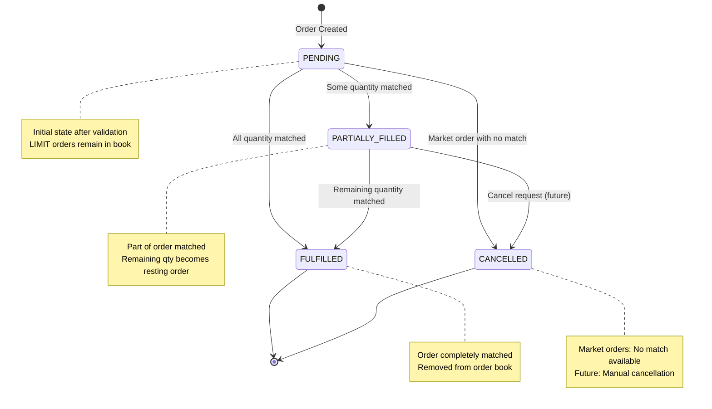

# Order Matching Engine


### Installation
```bash
# Install dependencies
chmod +x scripts/install-deps.sh
./scripts/install-deps.sh 

# Build and Run
cmake -S . -B build
cmake --build build
./build/OrderMatchingEngine 
````


### Order State
