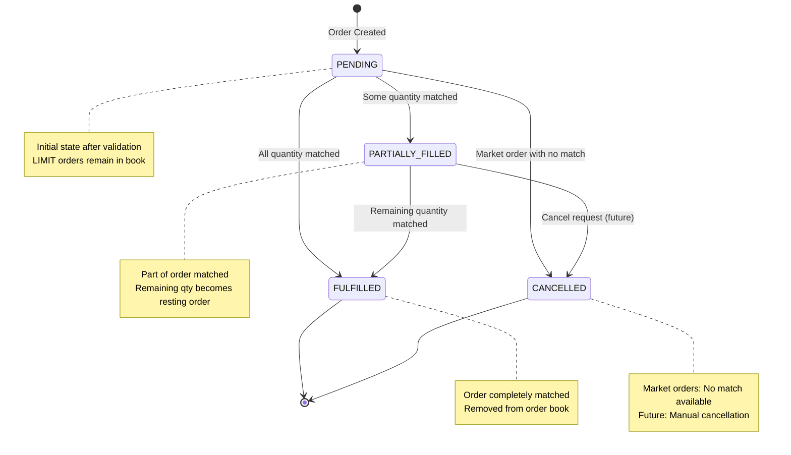

# Order Matching Engine


### Installation
```bash
# Install dependencies
chmod +x scripts/install-deps.sh
./scripts/install-deps.sh 

# Build
cmake -S . -B build
cmake --build build

# Run
./build/OrderMatchingEngine 
````

### Class Diagram

```mermaid
graph TB
    %% ============ Application Layer ============
    Main["main.cpp<br/>Entry Point"]
    App["Application<br/>───────<br/>-mConfig: Config<br/>-mOrderBookScheduler<br/>-mOrderInjectorScheduler<br/>───────<br/>+start()<br/>+shutdown()<br/>+simulate()"]
    
    Config["ConfigReader<br/>───────<br/>Static utility class<br/>───────<br/>+LoadConfig(path)<br/>-GetRequiredElementText()<br/>-GetRequiredElementSizeT()"]
    
    ConfigStruct["Config Struct<br/>───────<br/>+obWorkerPrefix: string<br/>+obWorkerCnt: size_t<br/>+oiWorkerPrefix: string<br/>+oiWorkerCnt: size_t"]
    
    %% ============ Scheduler Layer ============
    Scheduler["Scheduler (Abstract)<br/>───────<br/>-mWorkers: map&lt;string, Worker*&gt;<br/>-mLock: shared_mutex<br/>-mShutdown: bool<br/>───────<br/>+createWorker(id)<br/>+createWorkers(prefix, cnt)<br/>+start()<br/>+shutdown()<br/>+submitTo(wId, func, desc)<br/>#getWorker(id)"]
    
    OIScheduler["OrderInjectorScheduler<br/>───────<br/>-mWorkerPrefix: string<br/>-mWorkerCount: size_t<br/>-mOrderBookScheduler: shared_ptr<br/>-mNextWorkerId: atomic&lt;size_t&gt;<br/>───────<br/>+processIncomingOrder(msg)<br/>-getWorkerIdForOrder()"]
    
    OBScheduler["OrderBookScheduler<br/>───────<br/>-mSymbolToWorkerMap<br/>-mPrefix: string<br/>-mWorkersCnt: size_t<br/>-mObsLock: shared_mutex<br/>───────<br/>+processOrder(order)<br/>-getWorker(symbol)"]
    
    %% ============ Worker & Task ============
    Worker["Worker<br/>───────<br/>+mId: string<br/>-mQueue: queue&lt;Task&gt;<br/>-mQueueMutex: mutex<br/>-mThreadMutex: mutex<br/>-mCv: condition_variable<br/>-mThread: thread<br/>-mStop: bool<br/>───────<br/>+start()<br/>+postTask(task)<br/>+postStop()<br/>+join()<br/>-run()"]
    
    Task["Task Struct<br/>───────<br/>+id: uint64_t<br/>+func: TaskFn<br/>+token: CancelToken<br/>+desc: string<br/>───────<br/>+operator()()"]
    
    CancelToken["CancelToken<br/>───────<br/>-cancelled: shared_ptr&lt;atomic&lt;bool&gt;&gt;<br/>───────<br/>+isCancelled()<br/>+cancel()"]
    
    %% ============ Order Book Layer ============
    OrderBook["OrderBook<br/>───────<br/>-mSymbol: Symbol<br/>-mTrackerStore: map&lt;Side, OrderTracker&gt;<br/>-mStats: Stats<br/>-static Registry registry<br/>───────<br/>+processOrder(order)<br/>+getOrCreate(symbol)$<br/>-matchOrder(order)<br/>-addRestingOrder(order)<br/>-getOrderTracker(side)<br/>-updateOrder(order, qty)$"]
    
    Registry["OrderBook::Registry<br/>───────<br/>-registry: map&lt;Symbol, shared_ptr&lt;OrderBook&gt;&gt;<br/>-mtx: shared_mutex<br/>───────<br/>+createOrderBook(symbol)<br/>+getOrderBook(symbol)<br/>+getOrCreateOrderBook(symbol)<br/>+exists(symbol)<br/>+erase(symbol)<br/>+cleanupRegistry()"]
    
    Stats["OrderBook::Stats<br/>───────<br/>+marketPrice: uint64_t<br/>+lastTradePrice: uint64_t<br/>+totalOrdersAdded: uint64_t<br/>+totalVolume: uint64_t<br/>+totalTrades: uint64_t<br/>───────<br/>+reset()<br/>+toString()"]
    
    %% ============ Order Tracker Layer ============
    OrderTracker["OrderTracker<br/>───────<br/>-mSide: Side<br/>-mOrderLocationMap<br/>-mPriceLevelMap<br/>───────<br/>+addOrder(order)<br/>+matchOrder(qty, min, max)<br/>+getPriceLevel(price)<br/>+getOrCreatePriceLevel(price)<br/>+createPriceLevel(price)"]
    
    PriceComparator["PriceComparator<br/>───────<br/>+isBuySide: bool<br/>───────<br/>+operator()(a, b)"]
    
    %% ============ Price Level Layer ============
    PriceLevel["PriceLevel<br/>───────<br/>-mPrice: Price<br/>-mOrders: vector&lt;unique_ptr&lt;Order&gt;&gt;<br/>-mTotalQuantity: Quantity<br/>-mOrderCount: Count<br/>───────<br/>+addOrder(order)<br/>+removeOrder(itr)<br/>+matchOrders(maxQty)<br/>+getPrice()<br/>+getTotalQuantity()<br/>+isEmpty()<br/>+frontOrder()"]
    
    MatchResult["MatchResult Struct<br/>───────<br/>+remaining: Quantity<br/>+trades: vector&lt;MatchedTrade&gt;"]
    
    MatchedTrade["MatchedTrade Struct<br/>───────<br/>+restingOrderId: OrderId<br/>+qty: Quantity<br/>+price: Price"]
    
    %% ============ Order Layer ============
    Order["Order<br/>───────<br/>-mId: OrderId<br/>-mSide: Side<br/>-mQty: Quantity<br/>-mOpenQty: Quantity<br/>-mSymbol: Symbol<br/>-mStatus: Status<br/>-mType: Type<br/>-mPrice: Price<br/>-mStopPrice: Price<br/>-static DefaultValidatorPtr<br/>───────<br/>+MakeLimit(...)$<br/>+MakeMarket(...)$<br/>+MakeStop(...)$<br/>+MakeStopLimit(...)$<br/>+id(), side(), qty()<br/>+updateOpenQty(qty)<br/>+updateStatus(status)<br/>+SetDefaultValidator()$"]
    
    %% ============ Validation Layer ============
    IValidator["IValidator (Interface)<br/>───────<br/>+validate(order, reason)*"]
    
    OrderValidator["OrderValidator<br/>───────<br/>-mChain: vector&lt;unique_ptr&lt;IValidator&gt;&gt;<br/>───────<br/>+add(validator)<br/>+validate(order, reason)"]
    
    QuantityValidator["QuantityValidator<br/>───────<br/>+validate(order, reason)"]
    
    LimitPriceValidator["LimitPriceRequiredValidator<br/>───────<br/>+validate(order, reason)"]
    
    StopPriceValidator["StopPriceRequiredValidator<br/>───────<br/>+validate(order, reason)"]
    
    NoOpValidator["NoOpValidator<br/>───────<br/>+validate(order, reason)"]
    
    %% ============ Type Definitions ============
    Types["Types.h<br/>───────<br/>Price = int64_t<br/>Quantity = uint64_t<br/>OrderId = uint64_t<br/>Symbol = string<br/>───────<br/>enum Side {BUY, SELL}<br/>enum Type {MARKET, LIMIT, STOP, STOP_LIMIT}<br/>enum Status {PENDING, CANCELLED, FULFILLED, PARTIALLY_FILLED}"]
    
    %% ============================================
    %% Main Connections
    %% ============================================
    
    Main -->|"creates"| App
    Main -->|"loads config via"| Config
    Main -->|"sets up validators"| OrderValidator
    
    Config -->|"returns"| ConfigStruct
    App -->|"contains"| ConfigStruct
    
    %% Application to Schedulers
    App -->|"owns shared_ptr"| OIScheduler
    App -->|"owns shared_ptr"| OBScheduler
    
    %% Scheduler Hierarchy
    OIScheduler -.->|"inherits"| Scheduler
    OBScheduler -.->|"inherits"| Scheduler
    
    %% Cross-Scheduler Communication
    OIScheduler -->|"delegates to"| OBScheduler
    
    %% Scheduler to Workers
    Scheduler -->|"creates & manages"| Worker
    Worker -->|"processes"| Task
    Task -->|"uses"| CancelToken
    
    %% Order Injection Flow
    OIScheduler -->|"parses message<br/>creates Order"| Order
    OBScheduler -->|"routes Order<br/>by symbol"| OrderBook
    
    %% Order Book Structure
    OrderBook -->|"uses (static)"| Registry
    OrderBook -->|"contains"| Stats
    OrderBook -->|"contains 2<br/>(BUY & SELL)"| OrderTracker
    
    Registry -->|"manages<br/>shared_ptr"| OrderBook
    
    %% Order Tracker Structure
    OrderTracker -->|"uses for sorting"| PriceComparator
    OrderTracker -->|"manages multiple"| PriceLevel
    
    %% Price Level Structure
    PriceLevel -->|"stores vector of<br/>unique_ptr"| Order
    PriceLevel -->|"returns"| MatchResult
    MatchResult -->|"contains vector"| MatchedTrade
    
    %% Order Validation
    Order -->|"validated by"| IValidator
    IValidator <-.->|"implements"| OrderValidator
    IValidator <-.->|"implements"| QuantityValidator
    IValidator <-.->|"implements"| LimitPriceValidator
    IValidator <-.->|"implements"| StopPriceValidator
    IValidator <-.->|"implements"| NoOpValidator
    
    OrderValidator -->|"contains chain of"| IValidator
    Order -->|"uses default"| NoOpValidator
    
    %% Types Usage
    Order -->|"uses types from"| Types
    PriceLevel -->|"uses types from"| Types
    OrderTracker -->|"uses types from"| Types
    OrderBook -->|"uses types from"| Types
    
    %% ============================================
    %% Styling
    %% ============================================
    
    classDef entryPoint fill:#fff4e1,stroke:#ff9800,stroke-width:3px
    classDef application fill:#e3f2fd,stroke:#2196f3,stroke-width:2px
    classDef scheduler fill:#e8f5e9,stroke:#4caf50,stroke-width:2px
    classDef worker fill:#f3e5f5,stroke:#9c27b0,stroke-width:2px
    classDef orderBook fill:#ffebee,stroke:#f44336,stroke-width:2px
    classDef order fill:#fff3e0,stroke:#ff9800,stroke-width:2px
    classDef validation fill:#e0f2f1,stroke:#009688,stroke-width:2px
    classDef utility fill:#fce4ec,stroke:#e91e63,stroke-width:2px
    classDef types fill:#f5f5f5,stroke:#607d8b,stroke-width:2px
    
    class Main entryPoint
    class App,Config,ConfigStruct application
    class Scheduler,OIScheduler,OBScheduler scheduler
    class Worker,Task,CancelToken worker
    class OrderBook,Registry,Stats,OrderTracker,PriceComparator,PriceLevel,MatchResult,MatchedTrade orderBook
    class Order order
    class IValidator,OrderValidator,QuantityValidator,LimitPriceValidator,StopPriceValidator,NoOpValidator validation
    class Types types
```



### Order State
